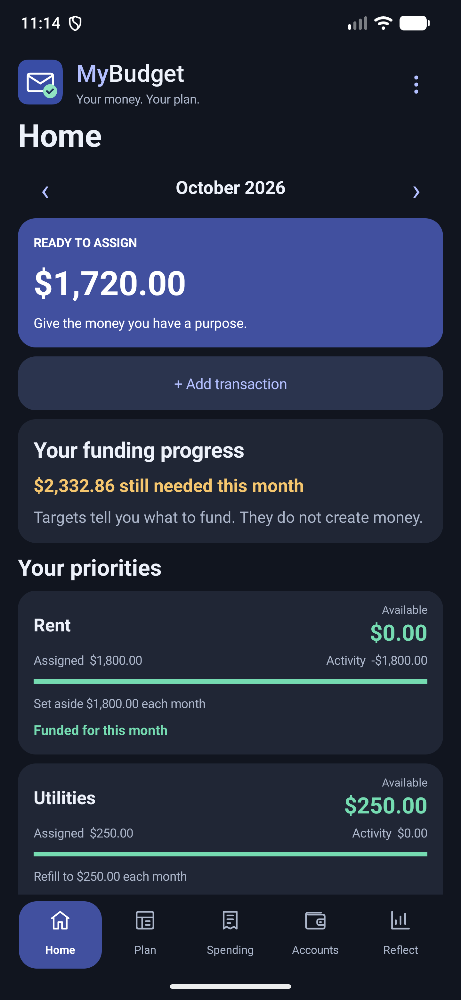
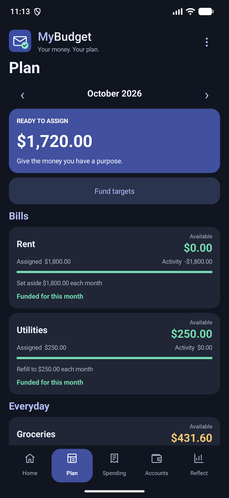
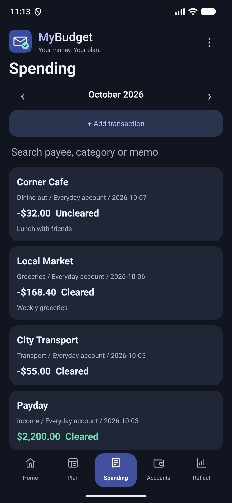
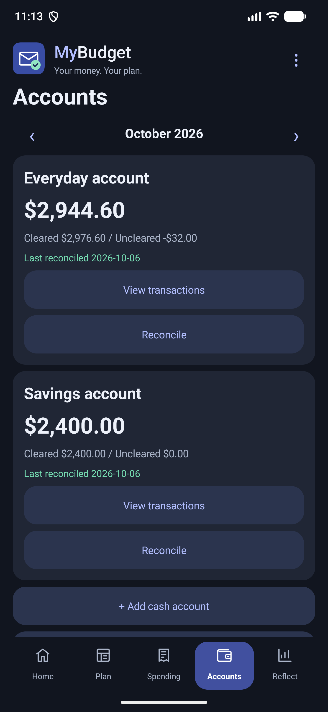
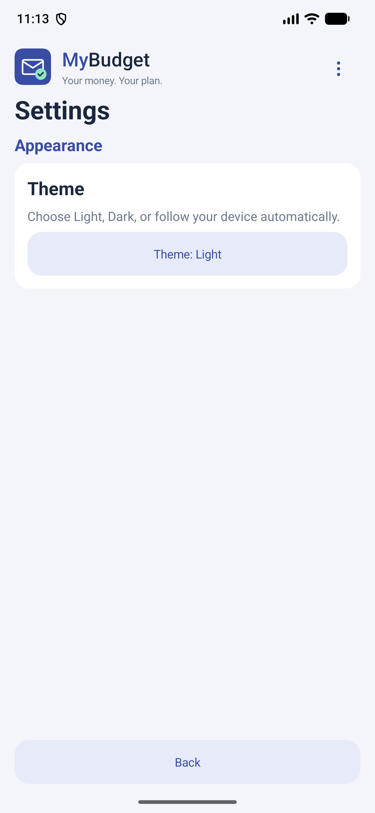

# MyBudget for Android

A native, offline envelope budgeting app. Give every dollar you have a job: put income into envelopes (categories), spend from them, roll what's left into next month, and move money between envelopes when one runs short.

## Download 0.0.9

[Download the signed APK](https://github.com/baslawson/mybudget/releases/download/v0.0.9/MyBudget-0.0.9.apk) · [Release notes](https://github.com/baslawson/mybudget/releases/tag/v0.0.9)

Install it with [Obtainium](https://github.com/ImranR98/Obtainium) to get updates automatically:

Android 8+ (API 26). Version `0.0.9`, version code `12`, package `com.mybudget.app`. The universal release APK is approximately 225 KB and uses a dedicated release-signing key. In Obtainium, you can also paste `https://github.com/baslawson/mybudget` as the app source. [Obtainium link documentation](https://wiki.obtainium.imranr.dev/deep_links/).

This release uses local device storage, manual entries, CSV imports, and expenses and upcoming bills from Planner (below). It does not sync with banks; back up to a file or a folder (Settings > Backup). The release signature differs from development/debug builds, so it cannot update those installations in place. Do not uninstall a debug build containing a budget you need to retain: uninstalling deletes that local budget.

## Screenshots

All accounts, payees, amounts and transactions shown below are fictional demo data from a separate preview installation.

 

  

## Versions

- **0.0.9**: getting a month ahead (next month funded, how To budget is worked out, cover from a later month), search by amount, statement rows matched to transactions you entered, OFX, QFX and QIF imports, payee category settings, card interest and fees, reconciled transactions locked, a coloured To budget figure and fixes from a bug hunt. Backups from 0.0.9 can't be restored in 0.0.8.
- **0.0.8**: a livelier look and a new logo, a faster Add transaction form, one currency per budget, a home-screen widget and shortcuts, a yearly report, first-run setup, upcoming splits, Undo after deletes, speed with years of data, and fixes from a bug hunt.
- **0.0.7**: fixes for re-imports after renaming payees, yearly repeats on 29 February, damaged-data checks and part payments of Planner bills.
- **0.0.6**: new targets, tracking accounts and loans, flags, filters, review of imported transactions, payee tools, reports and Home.
- **0.0.5**: suggestions as you type for groups, payees and notes.
- **0.0.4**: fixes for card credit, reports, repeating transactions, card payments and photos.
- **0.0.3**: fixes for credit-card credits, saving alongside Planner, CSV duplicates, open forms and backups.
- **0.0.2**: backup and import, planning tools, upcoming and split transactions, credit cards, Planner's upcoming bills.
- **0.0.1**: expenses from Planner.
- **0.0.0**: first release.

Updates keep your budget. Nothing has been checked on a physical phone yet, only on an emulator.

## Planner integration

Planner's “Send paid bills to MyBudget” opens `AddExpenseActivity` using `com.mybudget.app.action.ADD_EXPENSE`. The handoff includes `paymentId`, `billKey`, `payee`, `amountCents` (a long integer), `currency` (an ISO 4217 code such as `AUD`; missing means AUD), `date` (`YYYY-MM-DD`) and an optional `note`. MyBudget takes the payment only when its currency is the budget's (Settings > Currency); otherwise it says so ("This bill is in USD, but your budget is in AUD, so it wasn't added.") and saves nothing. The user confirms the expense before it is saved and chooses its category and account. Repeat bills suggest the category and account from the previous linked entry; an existing payment ID prevents a duplicate expense.

With the same setting on, Planner also sends its **upcoming bills** (unpaid bills from a month back to two months ahead; at most 200) when it opens and when it's left, as an explicit broadcast to `com.mybudget.app` with action `com.mybudget.app.action.UPCOMING_BILLS` and a JSON array extra `bills` of `{id, billKey, payee, due, amountCents?}` (its AUD bills only, for a MyBudget before currencies), plus `billsAll`: the same objects in every currency, each with its `currency`. `PlannerBills` uses `billsAll` when it's there and otherwise `bills` as AUD bills; a bill without a known currency is left out. It checks the list and replaces the last one (kept in preferences, not in the budget, and never entered as money). The list keeps each bill's currency, and only bills in the budget's currency are planned for or shown: after a change of currency, that currency's bills from the last list show straight away, and a list saved before currencies counts as AUD bills. On Android 14 and later Planner shares its identity with the broadcast and MyBudget accepts only Planner's packages (`io.github.baslawson.planner`, `.debug`). Transactions lists them under Coming up in Planner; each is planned from the category chosen there (`billCategories` in the budget, by `billKey`) or else its last expense's, and then counts in that category's upcoming bills and in Fund targets. The add-expense dialog suggests the same category when the bill is paid, and drops the paid bill from the list at once (by the `upcomingId` extra Planner sends with ADD_EXPENSE; without it, the earliest entry with the same `billKey`). A list more than 7 days old is ignored, with a note in Transactions. Planner adds `FLAG_INCLUDE_STOPPED_PACKAGES`, so the list also reaches a MyBudget that was force-stopped or never opened. Turning the setting off in Planner sends an empty list.

When Planner marks a payment unpaid, `com.mybudget.app.action.PAYMENT_UNDONE` with the same `paymentId` asks whether to remove the linked expense. The user can keep it; the question says when the expense is reconciled or matched to a bank statement row. If a bank statement was imported first, the add-expense dialog offers the imported row (same amount, dated within 7 days, not linked to Planner yet): **Use imported** links it to the payment (and gives it the category chosen there if it was still To categorize) instead of adding a second expense. With Planner 0.0.29 or later each upcoming bill also carries `paid`, the ids of the payments Planner already took off what's left, so a part payment still on its way isn't taken off twice. The dialog keeps what was typed when the phone is turned or the theme changes. Successful handoffs return `RESULT_OK` with a `summary`; cancellation defaults to `RESULT_CANCELED`. Both actions are exported to other apps, so preserve user confirmation before adding or removing data.

Budget storage version 3 persists `externalId` and `billKey` on entries and continues to read version 2 budgets. MainActivity reads the saved data in again when it changed since MainActivity last read or saved it (an expense received from another app), on resume and before each save, so neither side overwrites the other; the add-expense dialog also reads the latest data when it saves. The add-expense dialog leaves out hidden categories and closed accounts (a suggestion pointing at one is dropped). Categories carry optional `hidden`, `snoozed`, `note`, `dueDay`, `weekday`, `weeklyRefill`, `dueDate` and `repeatMonths` fields (the budget an optional `monthNotes` map of `YYYY-MM` to text) and accounts an optional `closed` flag; they read as defaults when missing. Storage version 5 (after 0.0.5; also read as defaults when missing): account type `tracking` with `liability`, `rate` (thousandths of a percent a year), `payment` and `frequency`; entry `flag` (0-6), `approved` (false only for imported rows still to review) and `bankPayee` (an imported row's own statement payee text, which re-imports match on even after the payee is renamed or merged); category `pinned`; and the budget's `flagNames`, `hiddenPayees` and import `rules` (each rule's text once). MyBudget 0.0.5 read these as version 4 and dropped them on its next save, so they now raise the version: 0.0.5 refuses version 5 data and backups. Storage version 6 (after 0.0.7) adds `splits` on upcoming transactions whose category is `split` (upcoming splits), each part with its `category`, `amount` and `memo`, and the budget's `currency` (an ISO 4217 code; versions 1 to 5 read as AUD, and an unknown code is refused as damaged data); MyBudget 0.0.7 and earlier refuse version 6 data and backups rather than losing them. Storage version 7 (after 0.0.8) adds the budget's `payeeCategories` (a lower-case payee to the category always suggested for it, or "" for none; payees not in it are automatic) and a transaction's `reconciled` (only with `cleared`), so 0.0.8 refuses version 7 data and backups (backup version 4); older data reads with none. Storage version 4 adds `scheduled` (upcoming transactions, which keep a `billKey`) and `splits` on entries whose category is `split`, plus account `type` (`cash` or `credit`) and a payment category's `cardAccount`; MyBudget reads versions 1 to 7 and refuses newer data rather than dropping what it can't read. Backups keep `externalId` and `billKey`, so a payment restored from a backup is still not added twice. Restoring an older backup drops expenses Planner sent after it; if such a bill is later marked unpaid, MyBudget finds nothing to remove and asks nothing. Future changes to storage, transaction editing, activity lifecycle or package/action names must consider this connection and verify the flow between both apps.

## Run

Open this folder in Android Studio, let Gradle sync, and run `app` on an emulator or Android device (Android 8 or newer). Use JDK 17 or 21 for Gradle and install Android SDK 35. Build a debug APK with `gradlew.bat assembleDebug`; the output is `app/build/outputs/apk/debug/app-debug.apk`.

## First budget

Open the **three-dot menu > Settings > Theme** to choose **Light**, **Dark**, or **Auto (follow device)**. The choice is saved across restarts. Auto follows Android's system light/dark setting, including changes while the app is open. Switching appearance preserves the selected screen, month and search; Back from Settings returns to your previous screen.

**First-run setup.** A brand-new budget (no accounts, no transactions and no money assigned yet) offers **Set up my budget** on Home's start card: a few short steps to choose the currency (your phone's, when it's one of the common ones, otherwise AUD), add your first account with its balance, and keep or untick the starter category groups (Bills, Everyday, True expenses, Savings). It ends by explaining To budget, with **Assign money now** to go to Budget. Every step can be skipped; Cancel or Back stops there and keeps what was already saved. Unticking a group removes only its starter categories that were never touched; nothing else is deleted, and a budget already in use never sees the setup.

1. Add cash, checking and savings accounts with their current opening balances.
2. Tap each category to assign some of the money to budget.
3. Record expenses against the category they belong to.
4. Move money from another category when an envelope is overspent.

**Currency.** A budget has one currency, AUD unless you choose another in **Settings > Currency** (common ones first, then every other currency in use, by code). Money is shown in it in your phone's number style (an Australian phone shows $1,234.56; a phone set to US English shows A$1,234.56 for AUD), and amount boxes say which currency they take ("Amount (AUD)"). Changing it converts nothing: $100.00 becomes €100.00, so the change asks first. Amounts are stored as integer cents in every currency and always show two decimals, even for currencies without cents such as the yen. Backups keep the currency, and restoring one brings its currency back. Each month's Budget displays Assigned, Activity and Available for grouped categories. Positive available balances roll forward. Uncovered cash overspending resets the category at rollover and reduces the following month's To budget. Transactions are recorded from an account's opening date onward. Future assignments reserve existing money; future income is never assumed.

Tap categories to assign or return money, move money, edit their group or target, view transactions, move them up or down within their group, hide them, or delete them. A hidden category leaves Budget and the pickers (including Planner's bills) but its money still counts; Budget lists hidden categories at the bottom with what they hold. Deleting a category that was used moves its transactions and monthly assignments to a category you choose, so cash is unchanged and Planner's bills suggest the new category. Assign offers quick amounts: underfunded (what the target and upcoming bills still need this month), assigned last month, average assigned and average spent over the last three full months (to the cent), spent last month, reset available (brings Available to $0) and reset assigned (back to $0 assigned, as far as money not yet spent allows). Fund targets on Budget assigns every underfunded category at once. An overspent category offers Cover overspending: pick a category with money, or To budget, and the amount is filled in. Move Money lists what each category has available. Dates are picked from a calendar and shown as "7 Oct 2026"; they're stored as `YYYY-MM-DD`. The payee field suggests payees used before, and picking one on a new transaction fills in its usual category (see Payees).

A target can be snoozed for the month (it asks for nothing and Fund targets skips it), Refill, Monthly and debt payment targets can have a due day ("by the 15th"; Fund targets funds the earliest due first; a weekly target counts from its first chosen weekday of the month and a by-date target from its date), and a category can carry a note shown on its card. Each month can have its own note (up to 200 characters), shown at the top of Budget with a small Edit; backups keep it. The options menu has **Budget reset** (every category's money for the month goes back into To budget, with Undo budget reset on Budget) and **Hide amounts** (dots instead of money until you show them again). Reports adds an income and spending chart for six months (tap a month for its amounts; the list below is the same data), net worth with the change since last month, and Money age: money spent (from cash accounts and on credit cards, on the day it's spent) is matched to the oldest money received, and the figure is the average age over the last 10 outflows. Paying a card off is a transfer, not spending, so it doesn't count again. Inflows not given to a category (income, reconcile adjustments) are labelled To budget in Transactions and in the CSV.

**More targets.** A **weekly amount** asks for an amount every week on the day you choose, so a month asks for it once per that weekday ("$40 every Monday · 5 this month = $200"); *refill up to* counts what's left from last month, *set aside another* asks for the full amount every week. **Save for spending by a date** (a quarterly bill of $250 by 15 January) spreads what's still needed evenly over the months up to and including the due month; once the date passes it stops asking, or starts again for the next date if you chose to repeat every 3, 6 or 12 months. A **monthly debt payment** asks for the same amount every month, like Set aside, labelled for a debt. All of them work with Fund targets, snooze and the progress bar on each category.

**Quick maths.** Every amount box (transactions, assign, targets, splits, account balances, reconcile, move money, transfers) also takes a sum: `45+12.50`, `100-20`, `3*12.5`, `(10+5)/2`. Multiplying and dividing round half up to the cent; anything else that isn't a sum gets the usual message to check the amount. In the target box, starting with `+` adds to the current target (`+50` on a $300 target makes $350); in Assign, an amount already adds to what's assigned.

**Credit cards.** Add account > Credit card, with what you owe now. The card gets a payment category (group "Credit card payments"); what you already owe starts with nothing set aside, so assign money to that category to pay it down. Spending on the card from a category with money moves that money to the payment category, ready for the bill; spending beyond what the category has shows as credit overspending (amber) this month and then becomes card debt, without changing To budget. A refund on the card moves money back. A part into To budget on the card (a reward credit, a reconcile adjustment) isn't cash: it moves money between To budget and the payment category, so what's set aside keeps matching what's owed. Make a payment (on the card in Accounts) is a transfer from a cash account, filled in with what's set aside. A cash advance (a transfer from the card to a cash account) is borrowed money: it goes into the card's payment category, set aside to repay it, so To budget doesn't grow. Card spending counts as spending in Reports; net worth includes what cards owe; Money age counts card spending on its date, not the later card payment. Payment categories can't be spent from directly (except for their own card's interest and fees, below), deleted, or emptied by Budget reset; deleting an unused card removes its payment category.

**Interest and fees.** **Add interest or fee** on a card in Accounts records interest, an annual fee or a late fee (or a refund of one) on that card, in its payment category. It's more debt, like what the card owed when it was added: no category pays for it, so nothing shows as overspent and To budget doesn't change, and nothing is set aside for it until you assign money to the payment category (a monthly debt payment target there helps pay it off). The payment category shows "Interest and fees this month", Transactions lists them as Interest and fees, and Reports count them as spending under the card. A card transaction that is really interest or a fee (an imported one, say) has **It's interest or a fee on <card>** in its form, which turns it into one (it keeps its Planner link and statement text). Only that card's own payment category takes them; paying a card is still a transfer.

**Split transactions.** "Split into categories" in the transaction form spreads one expense or refund over two or more categories (a part can also go into To budget, e.g. cash back). The amount becomes the parts' total; each part counts in its own category, Transactions lists the categories, and the CSV has one row per part. Split evenly divides the total across the parts (leftover cents go on the first parts) and Fill remaining puts what's left of the total into the part you last typed in, or the last empty one. Each part can have its own note (shown in the split form and used for that part's CSV row). A split can also be upcoming (a future date or a repeat): each part counts in its own category's upcoming bills and in Fund targets, Transactions lists it with its categories, and entering it makes a split with the same parts and notes.

**Tracking accounts.** Add account > Tracking, for money you want to see but not budget: an **asset** (savings held elsewhere, investments, a house, super) or a **loan or debt** (mortgage, car loan). They're off budget: they never change To budget, your categories, or the spending and income reports, but they count in Net worth (assets add, debts subtract). Accounts lists them in their own section; **Update balance** records today's figure as a balance update. Moving money from your budget to a tracking account (an extra mortgage payment, an investment deposit) is spending, so the transfer asks which category it comes from; money moved from a tracking account into your budget is income to To budget.

**Payoff planner.** Give a loan its interest rate, regular payment and how often it's paid (Edit account), then open **Payoff planner** to see when it's paid off and the total interest. Type an extra amount per payment to see the difference, e.g. "$100 extra: 5 years 6 months sooner, $49,138.86 less interest". Interest is worked out monthly on what's owed, to the cent; a weekly or fortnightly payment counts as its monthly average. If the payment doesn't cover the interest, it says so.

**Flags.** Mark a transaction with a red, orange, yellow, green, blue or purple flag (in its form); a coloured dot shows on its row. Name a colour once in Settings, such as green for "Tax", and filter Transactions by flag.

**Search and filters.** Transactions has **Filters**: account, category, flag, cleared or not, and a date range (without one, the month on screen). They combine with each other and with the search box; a line shows what's being shown, and **Clear filters** goes back to everything this month. **This month**, **Last month** and **Last 3 months** (this month and the two before) fill in both dates, counted from today. The search box also finds amounts, by size whether money came in or went out: `>=100`, `>100`, `<50`, `<=50` or `=42.50` look at the amount only, and a plain number such as `42.50` finds that amount as well as any payee, category or note containing it. A currency symbol and thousands commas are fine (`=$1,200`).

**Review imported transactions.** Rows from a bank statement import are marked "To review" until you approve them. Transactions shows "Review N imported", listing them with **Approve**, **Edit** (saving an edit approves it too) and **Approve all**. Transactions you enter yourself or that come from Planner don't need reviewing.

**Payees.** Settings > Payees (or the Payees button in Transactions) lists every payee: rename one (its transactions and upcoming ones follow), merge it into another (the one you pick is kept), or hide it from suggestions (its transactions stay). **Category** sets what a new transaction or imported row with that payee is given: **automatic** (the default: the category it usually has, which one odd purchase doesn't change: a different category becomes the usual one only when two of its last three transactions have it; splits, transfers and To categorize don't count), **always** one category, or **don't suggest** one. Renaming or merging a payee keeps its setting; deleting its category moves the setting with the transactions. **Import rules** rename statement payees and/or choose their category when a payee contains some text, e.g. "contains WOOLWORTHS → Woolworths, Groceries". Capitals don't matter, the first matching rule wins, and rules can be edited or removed.

**Home.** MyBudget opens on Home: To budget, a quick **+ Add transaction**, and **Needs attention**: overspent categories (with **Cover**), money in To budget waiting to be assigned (or To budget below $0), upcoming transactions and Planner bills due in the next 7 days (overdue ones too), and imported transactions to review, and a reminder when your budget hasn't been backed up for 14 days (or ever) once it has an account. Tap any of them to go where it's dealt with; the backup reminder opens Settings at Backup, and **Remind me in a week** puts it off for 7 days. When nothing needs you, it says "All set". Below that are your funding progress and your **priority categories**.

**How To budget is worked out.** Tap the To budget card (Home or Budget) for the sum behind it, which always adds up exactly: the money in your cash and bank accounts (at the end of the month, for a past month), less what categories hold, less what's set aside for card payments, plus what card payment categories are below zero (paid beyond what was set aside), plus cash overspending this month (it comes off next month's To budget instead), less money already assigned in later months. Under it: the month's income and how much was assigned in it.

**Getting a month ahead.** Home shows how much of next month is already funded: "Next month: November · 64% funded · A$1,280.00 of A$2,000.00 assigned for its targets and bills", with a bar. It counts next month's targets and its upcoming transactions and Planner bills (hidden categories left out), worked out as Budget would for that month: what's left this month counts where a target counts carried money for next month, and assigning more than a target asks doesn't count twice. Tap it for what's assigned in each later month and which categories still need money next month, and **Go to November in Budget** to assign there (Fund targets works for any month). When next month is funded, this month's income pays next month's bills.

**Cover from a later month.** Cover overspending also offers money already assigned in later months ("Water in November (A$124.42 assigned)"), in this month or a later one and while To budget isn't below zero. It goes back to To budget in that month and covers this month's overspending; the confirmation says what that category will have left assigned there. Cash doesn't change.

**Priority categories.** Tap a category in Budget and choose **Pin to Home** (up to 5). Pinned categories show on Home with their Available and target progress; **Unpin from Home** takes one off. Pins are saved in backups.

**Spending pace.** In the current month, a category with a target or money assigned shows a small hint when it's being spent much faster than the month is passing: "Spending faster than the month: 70% spent, 40% of the month gone". It appears once at least $10 is spent (refunds count off) and the share spent is 20 points or more ahead of the share of the month gone. An overspent category shows its overspending instead.

**Spending breakdown.** Reports shows a ring chart of your spending by category, or by group, for this month, last month, the last 3 months or this year (counting back from the month on screen). The list under it has each one's amount and share, biggest first; past the biggest 7 the rest are added up as "Other". Tap a row to see its transactions for that period. Only spending from your budget counts: transfers between your accounts, credit card payments and tracking accounts don't. A category that got back more than it spent is left out of both views; those refunds are listed under the chart and come off the total for net spending.

**Spending trends.** Pick a category or a group to see its spending month by month over the last 6 or 12 months as small bars, with a dashed line for the average and the average in words. Tap a bar for that month's amount, or **Show as a list** for every month.

**Income and expenses.** A table in Reports: income by payee and spending by group and category (a card's interest and fees as "<card> interest and fees") for the last 6 months, with each row's average and total, and totals for income, expenses and net (income minus expenses). Scroll sideways to see every column.

**Yearly report.** Reports also sums up a calendar year (this year first; the arrows move between years that have transactions): income, spending and net (income minus spending), a bar chart and a list of each month's income and spending, your top 10 categories by spending with their share (the rest added up as "Other"), and every group's total and share. Spending counts as in the spending breakdown: only spending from your budget, net of refunds; transfers, card payments and tracking accounts don't count. Tap a category or group for its transactions that year.

**Home-screen widget.** Add the MyBudget widget from your launcher's widget list (3 × 2 to start; it can be resized). It shows this month's To budget and your pinned categories (up to 5, as many as fit) with what each has available, in your budget's currency. **+** opens the Add transaction form; tapping anywhere else opens Home. It follows the phone's light or dark theme, shows dots while Hide amounts is on, updates whenever the budget is saved (also by an expense from Planner, a restore or an undo) and each day for a new month, and says "Open MyBudget" if the saved budget can't be read.

**App shortcuts.** Long-press the MyBudget icon for **Add transaction**, **Budget** and **Transactions**. Before your first account they open Home, where the start card is.

**TalkBack and large text.** Every chart in Reports has a description that reads out its numbers (each month's income and spending, each slice's amount and share); on a bar chart, scrolling forward or back (or the arrow keys) picks the next or previous month and reads its amounts, as a tap does. Section titles are headings, amount boxes say they take sums, target progress bars say how far along they are, and the flag dots and symbol buttons (‹ › ⋮ ✕ +) have names. With very large text (130% or more) the header scrolls away with the screen, a category's Available sits under its name, Reports rows put the amount under the name, and a dialog's third button (Clear all filters, Skip this step, Remove split) moves into the dialog so none is cut off.

With **Hide amounts** on, the new screens hide money too; shares and percentages still show.

**Undo a delete.** After deleting a transaction (split and upcoming ones too), an account or a category (also when its transactions move to another category), a bar above the tabs says "Transaction deleted" with **Undo** for about 8 seconds; TalkBack reads it out. Undo puts the budget back exactly as it was just before the delete, Planner's payment ids included, so a restored Planner payment still isn't added twice. It goes away when you change tab or make another change, and if anything was saved since (an expense from Planner came in), Undo says it can't be undone rather than lose that. The delete confirmations are unchanged.

**Upcoming transactions.** A new transaction with a future date, or with a repeat (weekly, every 2 weeks, monthly, every 3 months, yearly), becomes upcoming. It isn't money yet: Transactions lists it under Upcoming, Home says when some are due, and on its day you enter it, skip it or edit it; nothing is entered without your tap. A repeating one dated today or earlier is entered at once and its repeats continue; monthly repeats keep their day (31st, then the 28th in February, then the 31st again). Budget shows each category's upcoming bills for the month, and Fund targets also covers them (upcoming bills less what the category has, or the target's need if larger), earliest date first. Editing a transaction keeps Planner's payment id and bill.

Accounts can be renamed (opening balance and date stay fixed; transfers named "Transfer to <account>" follow the new name), closed at a $0 balance (they move to Closed accounts, keep their transactions and can be reopened) or deleted when they have no transactions. Reconcile offers a cleared "Reconciliation adjustment" into To budget when your bank's cleared balance differs. Reconciling locks the account's cleared transactions (transfers in and out too; they show 🔒 Reconciled): opening one later warns that changing its amount, date or account, or deleting it, changes the balance you checked, and asks first. Unticking Cleared unlocks it. Storage version 7 keeps the lock (`reconciled` on transactions); older data reads with none locked. Targets support monthly refill, a fresh monthly contribution, a savings balance with an optional due month, a weekly amount, saving for spending by a date, and a monthly debt payment. Fund Targets assigns existing money in category order, up to the available amount.

Budget rows emphasize Available, with Assigned and Activity as secondary details. Targets show their behavior, funding progress and the amount left to fund this month; the target editor explains each type with an example. Bottom navigation includes icons. Transaction forms adapt to Expense, Income and Category refund; income hides the category, and notes are optional.

Viewing one account's transactions shows its balance after each one (newest first; cleared or not, transfers included). Transactions supports payee/category/memo search with filters (see below), income, expenses, category refunds, editing, deleting, and clearing transactions. Accounts show working and cleared balances and support transfers that do not count as spending. Reconcile compares your entered bank balance with the cleared balance; differences must be corrected through transaction records. Reports shows income, net spending after refunds, category breakdowns, and six months of cash flow.

The first upgrade preserves old category balances, cash and transactions and retains a `legacy_backup` snapshot in device preferences. The original version did not record assignment history, so the migration establishes assignments this month; it cannot recreate previous monthly plans accurately.

## Scope

This version supports cash accounts, credit cards and tracking accounts (assets and loans, off budget) and saves locally on the device. It has no bank sync or shared plans. Targets come in six kinds: refill to an amount each month, set aside a fresh amount each month, save toward a balance (optionally by a due month), a weekly amount, save for spending by a date, or a monthly debt payment. Uninstalling or clearing app storage deletes the budget, so keep a backup file (below).

## Backup, restore and export

**Settings > Backup** works through Android's file picker, so MyBudget needs no storage permission. It shows when the last backup was made ("Last backup: 8 Oct 2026", or "No backup yet"); Back up budget and automatic backups both count, and Home's backup reminder counts from that date, which is kept on this phone, not in backups.

- **Back up budget** saves `MyBudget-backup-YYYY-MM-DD.json` wherever you choose (Downloads, Drive, a computer). It holds the whole budget: accounts, categories, targets, monthly assignments and every transaction, including the Planner link identifiers. The file is the saved budget JSON plus `app`, `backupVersion` (4; version 3 backups from MyBudget 0.0.8, version 2 backups from 0.0.6 and 0.0.7 and version 1 backups from 0.0.5 and earlier still restore, and MyBudget 0.0.8 and earlier refuse version 4) and `created` fields.
- **Restore from backup** reads the whole file first and refuses anything that isn't a readable MyBudget backup, or one from a newer MyBudget, without changing anything. It then shows the backup's date and counts and asks before replacing the budget on this device. The replaced budget is kept on the device, and **Undo restore** in Settings puts it back until the next restore.
- **Export transactions (CSV)** saves every transaction for a spreadsheet: date, payee, category, group, account, transfer to, amount, note, cleared. Amounts are plain numbers in the budget's currency; the file doesn't name the currency. Text starting with `= + - @` gets a leading `'` so spreadsheets don't run it as a formula. A CSV can't be restored.

- **Automatic backup** (Settings): choose a folder once (Android's folder picker; Drive folders work where the Drive app offers them) and MyBudget saves `MyBudget-auto-YYYY-MM-DD.json` there once a day, keeping the newest 7 and leaving other files alone. It runs as a daily background job and when MyBudget opens; Back up now writes one at once, and Turn off stops it (files already saved stay).
- **Import transactions (CSV, OFX, QIF)** (Settings): pick a bank statement file. A CSV may use commas, semicolons or tabs between columns (whichever the first line uses most); match its columns (date, payee, amount, or separate money in and out columns), which are guessed from the header and remembered for next time. **OFX** and **QFX** files (OFX 1 or 2, bank or card) and **QIF** files (bank or card; investment files are refused, and so is a file of several accounts, QIF or OFX: download one account at a time) need no matching: their date, payee (OFX's name, else its memo; QIF's payee, else its memo) and amount fill the same form, already chosen. Dates are read as day/month first (also ISO, `7 Oct 2026` and, when day/month can't read them, US month/day; QIF's `9/10'26` too). Amounts may carry a currency symbol or code before or after the number (`$`, `€`, `£`, `A$`, `NZ$`, `12.50 EUR`, `USD -3`); it's ignored, and nothing is converted. A comma is a thousands separator (`1,250` is 1,250.00) unless just one or two digits follow it at the end, which only a decimal comma can be: `12,50` is 12.50 and `1.234,56` is 1,234.56; `DR` and `CR` after an amount still mean money out and in, and so does a trailing minus (`1.234,56-`). Rows already in the account (same date, amount and payee), dated in the future, or before the account opened are skipped. **Matching:** a row with the same amount as a transaction you entered in that account (by hand or from Planner) dated up to 7 days either side is that transaction: it's not added again. Exact duplicates are settled first for the whole file (a transaction the statement repeats exactly then remembers the statement's payee and is cleared, so no later statement takes it too); then the closest pairs are matched over the whole file, whatever the order of its rows (then the earlier transaction). Reconciled transactions are never matched: they're locked, and the transaction keeps its payee, category, note and Planner link, takes the statement's date, is cleared and remembers the statement's payee, so importing the same statement again skips it. Without one, an upcoming transaction in that account with the same amount due within 7 days is entered by the row (dated as the statement) and moves on to its next date. The summary lists what was matched so a wrong match can be spotted; transfers have their own check and imported rows are never matched again. Outflows get the payee's suggested category (see **Payees**), otherwise a new **To categorize** category; inflows go into To budget. Import rules (Settings > Payees) come first: the first rule whose text is in the payee renames it and/or gives its category, and the summary says how many rows matched a rule. Imported rows are cleared, noted "Imported" and marked to review.
- **Photos** on transactions (e.g. receipts): **+ Add a photo** offers **Take a photo** (your camera app; MyBudget asks for no camera permission) or **Choose from gallery**. Either is kept on this phone (in the app's files, at most 1600 px); a photo taken and then cancelled leaves nothing behind. Backups hold the budget, not photos: a restore says how many photos aren't on the phone. Photos no transaction uses are deleted when MyBudget starts.

Backups are plain, unencrypted files: keep them somewhere private.

## Calculation checks

Compile `Budget.java`, `CsvImport.java`, `DataSafety.java`, `app/src/androidTest/java/com/mybudget/app/SampleBudget.java` and `tests/BudgetTest.java` with a JDK, then run `BudgetTest`. Checks cover exact cents, quick maths, monthly assignments, rollover, overspending, edit/delete recalculation, targets, transfers, cleared balances, refunds, future reservations, the CSV export, deleting and reordering categories, closing and deleting accounts, reconcile adjustments, quick assign amounts, payee suggestions, weekly, by-date and debt payment targets, month notes, running balances, the split helpers, tracking accounts (off budget, in Net worth) and transfers to and from them, loan payoff maths, flag and combined filters, approving imported rows, payee rename/merge/hide and import rules, the spending breakdown (shares adding up to 100%, Other, by group, what counts as spending), spending trends and averages, the income and expense table, the spending pace hint, pinned categories, bills due in the next 7 days, the backup reminder and its snooze, when a delete can still be undone, and the daily automatic backup (a new day writes a new file, the same day doesn't, and only the newest 7 automatic backups are kept), upcoming splits (each part in its own category's upcoming bills and Fund targets, entered with the same parts) and Money age with card spending, and the budget currency (which codes count, the list to choose from, Planner's currency check and money shown in a currency), the yearly report (each month's income and net spending, the top 10 and every group adding up to the year's spending, what isn't spending, which years can be picked), currency symbols and codes in imported amounts, and the first-run setup (starter categories added once, unticked groups removed only while untouched, what counts as a brand-new budget, the suggested currency), getting a month ahead (what next month asks for and still needs, bills and over-assigning included), covering from a later month, the parts of To budget adding up on a generated year, and amount search, import matching (entered, Planner and upcoming transactions; closest date; never twice), payee category suggestions (two of the last three; always; none; renames and deleted categories), CSV separators, decimal commas, OFX and QIF, card interest and fees (more debt, never overspending, in the breakdown, only on their own card) and reconciled transactions locked; target needs are compared with the previous formula for every kind of target on a generated year. Month maths (Available, card payments, To budget, cash, balances, spending, money age) are worked out from one pass over the transactions and kept between screens; on a generated year of transactions (`SampleBudget`: two cards, splits, refunds, cash advances, tracking accounts) the check compares them, cached and not, with the plain sums worked out transaction by transaction, also after assigning, moving, entering and deleting while cached.

Build Android tests with `gradlew.bat assembleDebugAndroidTest`. Install both debug APKs and run `adb shell am instrument -w com.mybudget.app.test/com.mybudget.app.BudgetInstrumentation`. Tests exercise migration, persistence and backup files using Android's real JSON implementation and launch the actual Activity, including Home's backup reminder and Undo after a delete, and the currency: it round-trips in data and backups, older data reads as AUD, a Planner payment in another currency is refused with nothing saved, and upcoming bills come from `billsAll` by currency or from `bills` as AUD. They also draw the home-screen widget for no budget, a budget, Hide amounts, a short widget and unreadable data, open the Add transaction form, Budget and Transactions as the widget and shortcuts do (Home when there's no account yet), and check that the first-run setup is offered only for a brand-new budget, and that the budget is saved exactly as Android's JSONObject writes it. For speed checks, `adb shell am instrument -w -e sample 5y com.mybudget.app.test/com.mybudget.app.BudgetInstrumentation` replaces the budget on the device with a made-up five years (about 12,000 transactions; `1y` for one year) and reports how long saving, reading, backups and the widget take; it runs no tests.

## Release signing

`gradlew.bat assembleRelease` creates an unsigned APK. Published APKs are aligned and signed separately with the private MyBudget release key; signing files are excluded from Git and release uploads. Keep a secure backup of the signing key and its password to preserve Android update compatibility, and increment `versionCode` for each future release.

The release certificate SHA-256 fingerprint is `f895800a96ba9478851cf4620d6bcbfc4d1acfa2a1974167c5af69aa0dcd52cd`. Verify the APK download against the `SHA256SUMS.txt` asset included in each release. The certificate fingerprint is public; the signing key and password are private.

Build compatibility reference: [Android Gradle plugin release notes](https://developer.android.com/build/releases/gradle-plugin).
